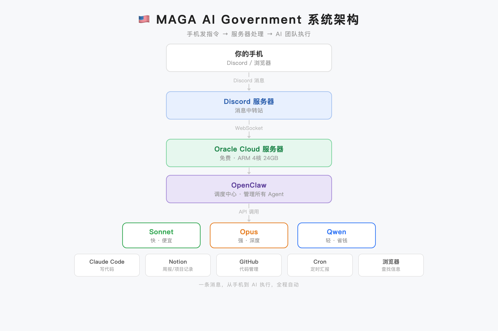
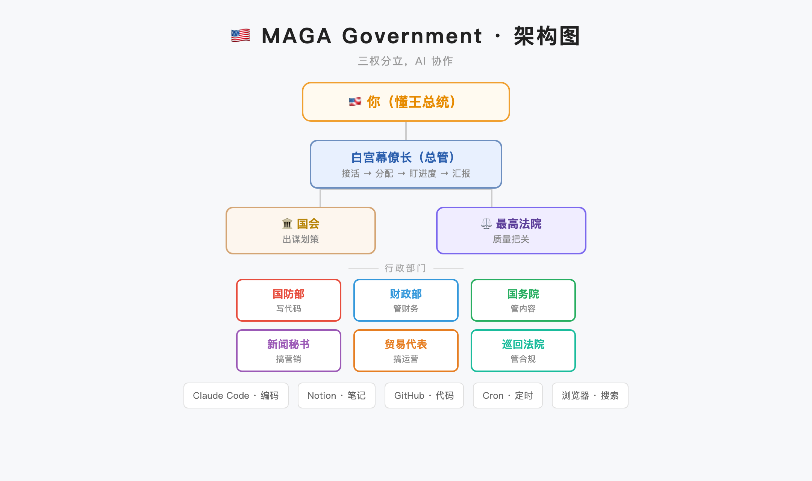
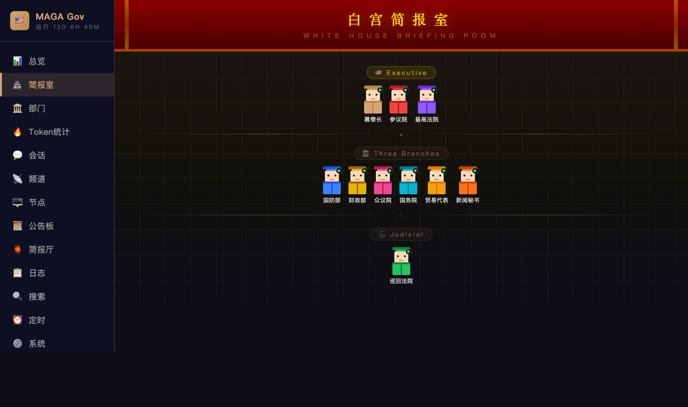
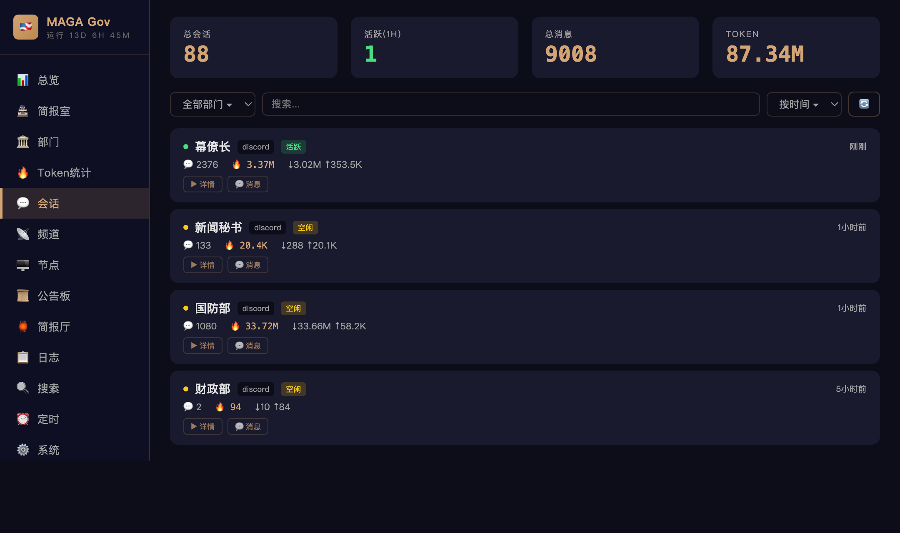

[中文版](./README.md) | [🏢 Corporate Edition: Become CEO](https://github.com/wanikua/become-ceo)

<!-- SEO Keywords: Three Branches, Separation of Powers, US Government, Legislative, Executive, Judicial, AI Government, AI Agent, Multi-Agent Collaboration, AI Management, MAGA, Trump, OpenClaw, multi-agent, american-government -->

# 🇺🇸 MAGA AI Government — Run Your AI Team Like the White House

### 30-Minute Setup · Multi-Agent Collaboration · Zero Code · American Democracy × Modern AI Management

> **Modeled after the US Three Branches System (三权分立制), built on the [OpenClaw](https://github.com/openclaw/openclaw) framework.**
> One server + OpenClaw = A 24/7 AI White House at your command.

<p align="center">
  
  
  
  
  
</p>

---

## 📜 What Is This?

**MAGA AI Government** is a ready-to-use multi-AI-agent collaboration system that maps the American **Three Branches System** (Legislative · Executive · Judicial) onto a modern AI agent organization.

**In plain terms:** You are the President 🇺🇸 (Trump-style), and AI agents are your Cabinet and government. You issue executive orders — but your power is checked! Congress can veto your proposals, and Courts can overrule non-compliant results. Just @mention an agent in Discord to issue an order, and the three branches collaborate to deliver — but nobody gets to be a dictator.

### 🤔 Why a Three Branches Architecture?

The US Constitution's Three Branches System has been the foundation of American democracy for over 230 years. Its core design principles:

- **🏛️ Separation of Powers** — Legislative, Executive, Judicial are independent; even the President can't override them all (= each AI Branch has its specialty)
- **📋 Checks and Balances** — Congress can veto Presidential proposals, Courts can overrule non-compliant results (= Agent cross-review, multi-step confirmation)
- **🔄 Due Process** — The President's major decisions follow "executive order → Congressional review → execution → judicial audit" (= multi-Agent chain collaboration)
- **📜 Judicial Review** — Courts can declare Presidential actions "unconstitutional" (= quality review, compliance checks, can reject)
- **🇺🇸 Executive Power** — The President is still the main character, setting the agenda and driving action (= users are the protagonist)

These concepts map perfectly to modern multi-agent system design needs. **The President leads, but checks and balances ensure nothing goes off the rails.**

### 🎯 Core Capabilities at a Glance

| Capability | Description |
|-----------|-------------|
| 🤖 **Multi-Agent Collaboration** | 10 independent AI Agents (Three Branches + Departments), each specialized, working in concert |
| 🧠 **Independent Memory** | Each agent has its own workspace and memory files — the more you use it, the better it knows you |
| 🛠️ **60+ Built-in Skills** | GitHub, Notion, Browser, Cron, TTS and more, ready out of the box |
| ⏰ **Automated Tasks** | Cron scheduling + heartbeat self-checks, 24/7 unattended operation |
| 🔒 **Sandbox Isolation** | Docker container isolation, agent code runs independently |
| 💬 **Native Discord** | Works on phone & desktop, @mention to invoke, zero learning curve |
| 🖥️ **Web Dashboard** | React + TypeScript dashboard for visual management |
| 🌐 **OpenClaw Ecosystem** | Built on [OpenClaw](https://github.com/openclaw/openclaw), access the [OpenClaw Hub](https://github.com/openclaw/openclaw) Skill ecosystem |

### 🏢 Prefer a Corporate Edition?

If you're more familiar with modern corporate management concepts, we have a **corporate version**:

👉 **[Become CEO](https://github.com/wanikua/become-ceo)** — Same architecture, using CEO / CTO / CFO / CMO roles

| 🇺🇸 Government Role | 🏢 Corporate Role | Responsibility |
|:---:|:---:|:---:|
| President 🇺🇸 | CEO | Top decision maker (but power is checked) |
| White House Chief of Staff | COO | Process coordination, task delegation |
| Senate | Board of Directors | Strategic review, can VETO proposals |
| House of Representatives | CFO | Budget approval, cost control |
| Defense Department | CTO / VP Engineering | Software engineering, architecture |
| Treasury Department | VP Finance | Financial analysis, cost management |
| State Department | VP Content | Content creation, documentation |
| US Trade Representative | VP Business Dev | Business development, partnerships |
| Press Secretary | VP Communications | Public relations, media |
| Supreme Court | General Counsel | Final compliance review, can OVERRULE |
| Circuit Court | QA Director | Quality assurance, risk assessment |

> 💡 Both projects are built on the same [OpenClaw](https://github.com/openclaw/openclaw) framework with identical architecture — only the role names and cultural context differ. Pick the style you prefer!

---



> 📌 **About Originality** — This project's architecture was inspired by [菠萝王朝 (Pineapple Dynasty)](https://github.com/wanikua/boluobobo-ai-court-tutorial), the original Chinese-style AI multi-agent collaboration system. This version reimagines it with the US Three Branches / Separation of Powers model.
>
> **Reposts welcome — please credit the source.**

---

## Why This Setup?

| | ChatGPT & Web UIs | AutoGPT / CrewAI / MetaGPT | **MAGA AI Government (This Project)** |
|---|---|---|---|
| Multi-agent collaboration | ❌ Single generalist | ✅ Requires Python orchestration | ✅ Config files only, zero code |
| Persistent memory | ⚠️ Single shared memory | ⚠️ BYO vector database | ✅ Each agent has its own workspace + memory files |
| Tool integrations | ⚠️ Limited plugins | ⚠️ Build your own | ✅ 60+ built-in Skills (GitHub / Notion / Browser / Cron …) |
| Interface | Web | CLI / Self-hosted UI | ✅ Native Discord (works on phone & desktop) |
| Deployment difficulty | No deployment needed | Docker + coding required | ✅ One-line script, up in 5 minutes |
| 24h availability | ❌ Manual conversations only | ✅ | ✅ Cron jobs + heartbeat self-checks |
| Organizational metaphor | ❌ None | ❌ None | ✅ Three Branches system, clear separation of powers |
| Framework ecosystem | Closed | Build your own | ✅ OpenClaw Hub Skill ecosystem |

**The key advantage: it's not a framework — it's a finished product.** Run a script, start chatting in Discord by @mentioning your agents.

---

## Architecture

```
                           ┌───────────────────────────┐
                           │  🇺🇸 President (You)       │
                           │   Discord / Web UI         │
                           └─────────────┬─────────────┘
                                         │ Executive Order (@mention)
                                         ▼
                    ┌──────────────────────────────────────────┐
                    │   OpenClaw Gateway (The Constitution)     │
                    │   Node.js Daemon                          │
                    │   ┌────────────────────────────────────┐  │
                    │   │ 📨 Message Routing (Due Process)    │  │
                    │   │ @mention → match → dispatch         │  │
                    │   │ Session isolation · Auto-Thread     │  │
                    │   └────────────────────────────────────┘  │
                    └───┬──────────────────┬───────────────────┘
                        │                  │
         ┌──────────────┘                  └──────────────┐
         ▼                                                ▼
  ┌──────────────────┐                       ┌──────────────────┐
  │ 🏛️ Legislative   │                       │ ⚖️ Judicial       │
  │                  │◄── Checks & ──►       │                  │
  │  Senate: Review  │    Balances           │ Supreme: Ruling  │
  │  House: Budget   │                       │ Circuit: Audit   │
  │                  │                       │                  │
  │ ✅ APPROVED      │                       │ ✅ CONSTITUTIONAL │
  │ ❌ VETOED        │                       │ ❌ OVERRULED      │
  └────────┬─────────┘                       └──────▲───────────┘
           │ Approved                               │ Submit for Review
           ▼                                        │
  ┌─────────────────────────────────────────────────┴──┐
  │              🏠 Executive Branch                    │
  │  ┌───────────────┐                                 │
  │  │Chief of Staff │→ Coordinate & Dispatch          │
  │  └───────────────┘                                 │
  │       │                                            │
  │  ┌────┴────┬────────┬────────┬────────┬────────┐   │
  │  │Defense  │Treasury│ State  │  USTR  │ Press  │   │
  │  │Code     │Finance │Content │  Biz   │ Media  │   │
  │  └────────┴────────┴────────┴────────┴────────┘   │
  └────────────────────────────────────────────────────┘
          │
          ▼
  ┌─────────────────────────────────────┐
  │  60+ Built-in Skills                │
  │  GitHub · Notion · Browser          │
  │  Cron · TTS · Screenshot            │
  │  OpenClaw Hub Extensions            │
  └─────────────────────────────────────┘
```

Each agent is a standalone Discord Bot bound to its own AI identity:
- **Independent memory**: Every agent has its own `memory/` directory — the more you use it, the better it knows your projects
- **Independent models**: Use power models for heavy lifting, fast models for light work — save money without sacrificing quality
- **Sandboxed execution**: Agent code runs in isolation, no cross-contamination
- **Identity injection**: OpenClaw automatically assembles SOUL.md + IDENTITY.md + workspace files into the system prompt

---

## 🎬 Demo: Discord Conversations

```
🇺🇸 President: @chiefofstaff Build me a user login REST API with Node.js + Express

🏠 Chief of Staff: YES MR. PRESIDENT! Executive order received! Initiating full process.
  📋 Submitting to Congress for review...

🏛️ Senate: Reviewing...
  ✅ Strategic assessment: User auth is foundational infrastructure, aligns with roadmap
  ✅ Tech stack: Node.js + Express + JWT is battle-tested
  📜 APPROVED — Strategically sound, proceed!

🏛️ House: Budget review...
  💰 Estimated API cost: $0.50 (power model, ~3 rounds)
  💰 Dev time: ~10 minutes
  📜 BUDGET APPROVED — Cost-effective. EVERY DOLLAR COUNTS!

🏠 Chief of Staff: Congress approved! Dispatching to Defense...

🎖️ Defense: YES SIR MR. PRESIDENT! MISSION RECEIVED!
  📁 Created auth-api/ project structure
  ✅ POST /api/login — JWT authentication
  ✅ POST /api/register — User registration
  ✅ middleware/auth.js — Token verification middleware
  ✅ Pushed to GitHub: your-repo/auth-api#1
  📋 MISSION ACCOMPLISHED! Submitting for judicial review...

⚖️ Circuit Court: Quality audit in progress...
  ✅ Code structure: Clean and well-organized
  ✅ JWT secret: Uses env vars, not hardcoded ✓
  ⚠️ Recommendation: Add rate limiting to prevent brute force attacks
  📜 RULING: CONSTITUTIONAL — Approved with one recommendation

🏠 Chief of Staff: MR. PRESIDENT, TASK COMPLETE! All three branches signed off ✅
  📋 Congress: ✅ | Executive: ✅ | Judiciary: ✅
  💡 Court recommendation: Consider adding rate limiting later
  TREMENDOUS SUCCESS! 🇺🇸
```

### Checks & Balances in Action

```
🇺🇸 President: @chiefofstaff Scrape all user data from a competitor's website

🏠 Chief of Staff: YES MR. PRESIDENT! Submitting to Congress...

🏛️ Senate: Reviewing...
  ❌ VETOED — WITH ALL DUE RESPECT, MR. PRESIDENT...
  Scraping personal user data likely violates GDPR/CCPA
  💡 Alternative: Scrape publicly available product/pricing data for competitive analysis

🏠 Chief of Staff: MR. PRESIDENT, Congress vetoed the request due to legal risk.
  📋 Senate suggests pivoting to public data scraping. Shall I resubmit?

🇺🇸 President: Fine fine, go with public data, but make it fast!

🏠 Chief of Staff: Revised proposal submitted for review...
🏛️ Senate: ✅ APPROVED — Public data scraping is compliant
🏛️ House: ✅ BUDGET APPROVED
  ... (normal execution + review follows)
```

---

## Use Cases

| Scenario | Description | Branches Involved |
|----------|-------------|-------------------|
| 🚀 **Solo Developer** | One person, complete tech team — coding + DevOps + marketing covered | Defense + Executive + State |
| 🏫 **Student Learning** | AI tutor team — different subjects, different agents, each with memory | All Branches customizable |
| 🏢 **Startup Team** | Low-cost AI assistant matrix covering product, tech, and operations | All Three Branches |
| 📱 **Content Creator** | Content creation + data analytics + finance management all-in-one | State + Treasury |
| 🔬 **Research Project** | Literature search + code experiments + paper writing | Defense + State |
| 🎮 **AI Experiments** | Agent-to-agent conversations, simulated government sessions | All Three Branches |

---

## Quick Start

### Step 1: One-Line Deployment (5 minutes)

Grab a Linux server and SSH in. Recommended providers:

| Provider | Config | Cost |
|----------|--------|------|
| **Alibaba Cloud** | ECS 2C4G / ARM | Free trial / from ¥40/mo |
| **Tencent Cloud** | Lighthouse 2C4G | Free trial / from ¥40/mo |
| **Huawei Cloud** | HECS 2C4G | Free trial |
| **AWS** | t4g.medium (ARM) | Free Tier 12 months |
| **GCP** | e2-medium | Free Trial 90 days |
| **Oracle Cloud** | ARM 4C24G | **Always Free** |
| **Local Mac** | M1/M2/M3/M4 | No server needed |

Then run:

```bash
bash <(curl -fsSL https://raw.githubusercontent.com/ayrnb/mage-agent/main/install.sh)
```

The script automatically handles:
- ✅ System updates + cloud provider firewall configuration
- ✅ 4 GB Swap (prevents OOM kills)
- ✅ Node.js 22 + GitHub CLI + Chromium
- ✅ Global OpenClaw installation
- ✅ Workspace initialization (SOUL.md / IDENTITY.md / USER.md / openclaw.json multi-agent template)
- ✅ Gateway systemd service (auto-starts on boot)

The install script features color-coded output with progress indicators and ✓ success markers for each step.

> 💡 **Already have OpenClaw/Clawdbot installed?** Use the lite script — skips system dependencies, only initializes workspace and config templates:
> ```bash
> bash <(curl -fsSL https://raw.githubusercontent.com/ayrnb/mage-agent/main/install-lite.sh)
> ```
> Supports two modes: Discord multi-Bot mode or pure WebUI mode (no Discord needed).

> 🍎 **macOS user?** Use the Mac-specific script — installs all dependencies via Homebrew:
> ```bash
> bash <(curl -fsSL https://raw.githubusercontent.com/ayrnb/mage-agent/main/install-mac.sh)
> ```
> Supports both Intel and Apple Silicon (M1/M2/M3/M4), auto-detects architecture.

### Step 2: Add Your Keys (10 minutes)

After the script finishes, you just need two things:

1. **LLM API Key** → From your LLM provider's dashboard
2. **Discord Bot Token** (one per department) → [discord.com/developers](https://discord.com/developers/applications)

```bash
# Edit config — fill in API Key and Bot Tokens
# Full install uses ~/.openclaw/openclaw.json; lite install uses ~/.clawdbot/clawdbot.json
vim  ~/.openclaw/openclaw.json

# Start the government
systemctl --user start openclaw-gateway

# Verify
systemctl --user status openclaw-gateway
```

@mention your Bot in Discord and say something. If it replies, you're live.

### Step 3: Full Three Branches + Automation (15 minutes)

```
@chiefofstaff Build me a user login API
→ Chief of Staff coordinates: Congress reviews ✅ → Defense executes → Court audits ✅ → Delivered. TREMENDOUS!

@treasury How much did we spend on APIs this month?
→ Treasury (Power Model): Cost breakdown + optimization recommendations (routine queries skip full process)

@presssec Write a tweet about AI tool recommendations
→ Press Secretary (Fast Model): Copy + hashtags. TRUTH OVER FAKE NEWS!

@chiefofstaff Build a complete e-commerce backend system
→ Senate: Strategic review... | House: Budget approval... | Defense: Modular development... | Supreme Court: Security audit...
```

Set up automated daily reports:
```bash
# Get the Gateway Token
openclaw gateway token

# Auto-generate daily report at 22:00 EST
openclaw cron add \
  --name "Daily Report" --agent chiefofstaff \
  --cron "0 22 * * *" --tz "America/New_York" \
  --message "Generate today's daily report, write to Notion and post to Discord" \
  --session isolated --token <your-token>
```



---

## Government Architecture — The Three Branches System

### Historical Background

The US Constitution established the **Three Branches of Government**:
- **Legislative Branch (Congress)**: Makes laws, controls budget, **can VETO Presidential proposals** (= strategic review, budget control, rejection power)
- **Executive Branch (President & Cabinet)**: The President holds executive power, but **major plans need Congressional approval** (= task execution, daily operations)
- **Judicial Branch (Courts)**: Interprets laws, **reviews Presidential actions for constitutionality** (= quality review, compliance checks, can reject)

In this project, OpenClaw Gateway plays the role of the Constitution. **The President (user) is the protagonist with executive power and agenda-setting authority, but that power is checked by Congress and the Courts.**

### 🔄 Checks & Balances Flow

```
President issues order → Congress reviews (can VETO) → Executive executes → Courts review (can OVERRULE) → Deliver
                            ↑                                                  │
                            └──── If rejected, President revises & resubmits ──┘
```

| Check | Description |
|-------|-------------|
| Congress → President | Congress can VETO proposals, requiring revision and resubmission |
| Judiciary → Executive | Courts can OVERRULE results, requiring remediation |
| President → Congress | President can pressure and negotiate, but can't bypass Congress |
| Judicial Independence | Supreme Court answers only to the Constitution (SOUL.md), not the President |
| Presidential Leadership | President sets the agenda, issues orders, drives the government forward |

| Branch | Department | Government Role | AI Role | Model | Use Cases |
|--------|------------|----------------|---------|-------|-----------|
| **Legislative** | **Senate** | Strategic review, can VETO | Long-term planning | Power | Strategic decisions, architecture approval |
| **Legislative** | **House** | Budget approval, can REJECT | Cost control | Fast | Resource allocation, budget oversight |
| **Executive** | **Chief of Staff** | Process coordination | Central dispatch | Fast | Task delegation, cross-branch coordination |
| **Executive** | **Defense** | Only executes approved tasks | Software engineering | Power | Coding, architecture, debugging |
| **Executive** | **Treasury** | Subject to Congressional oversight | Finance & operations | Power | Cost analysis, budgeting, reports |
| **Executive** | **State** | Output requires compliance review | Content & marketing | Fast | Copywriting, documentation |
| **Executive** | **USTR** | Major decisions need Congress | Business development | Fast | Market analysis, partnerships |
| **Executive** | **Press Secretary** | Must confirm compliance first | PR & communications | Fast | Marketing, public relations |
| **Judicial** | **Supreme Court** | Can OVERRULE non-compliant results | Final review | Power | Legal compliance, final decisions |
| **Judicial** | **Circuit Court** | Can require remediation | Quality assurance | Fast | Code review, risk assessment |

> 💡 Model tiering strategy: Use power models for heavy tasks (coding/analysis), fast models for light tasks (copywriting/management) — saves roughly 5× on costs. You can also plug in economy models for further savings.

---

## Core Capabilities

### 🤖 Multi-Agent Collaboration
Each department is its own Bot. @mention one and it responds; @everyone triggers all of them. Large tasks automatically spawn Threads to keep channels tidy.
> ⚠️ To enable Bot-to-Bot interactions (e.g., multi-Bot discussions), add `"allowBots": true` in the `channels.discord` section of `openclaw.json`. Without this, Bots ignore messages from other Bots by default. Each account also needs `"groupPolicy": "open"`, otherwise group messages will be silently dropped.

### 🧠 Independent Memory System
Each agent has its own workspace and `memory/` directory. Project knowledge accumulated through conversations is persisted to files and retained across sessions. The more you use an agent, the better it understands your project.

### 🛠️ 60+ Built-in Skills (Powered by OpenClaw Ecosystem)
It's not just a chatbot — the built-in toolset covers the entire development lifecycle, and you can extend with more Skills from [OpenClaw Hub](https://github.com/openclaw/openclaw):

| Category | Skills |
|----------|--------|
| Development | GitHub (Issues/PRs/CI), Coding Agent |
| Documentation | Notion (databases/pages/automated reporting) |
| Information | Browser automation, Web search, Web scraping |
| Automation | Cron scheduled tasks, Heartbeat self-checks |
| Media | TTS voice, Screenshots, Video frame extraction |
| Operations | tmux remote control, Shell command execution |
| Communication | Discord, Slack, Lark (Feishu), Telegram, WhatsApp, Signal… |
| Extensions | OpenClaw Hub community Skills, Custom Skills |

### ⏰ Scheduled Tasks (Cron)
Built-in Cron scheduler lets agents run tasks on autopilot:
- Auto-generate daily reports, post to Discord + save to Notion
- Weekly summary roll-ups
- Scheduled health checks and code backups
- Any custom recurring task you can think of

### 👥 Team Collaboration
Invite friends to your Discord server — everyone can @mention department Bots to issue commands. No interference between users, and results are visible to all.

### 🔒 Sandbox Isolation
Agents can run inside Docker sandboxes with isolated code execution. Supports configurable isolation levels for networking, filesystem, and environment variables.

---

## 🖥️ GUI Management Interface

Beyond Discord command-line interaction, the MAGA AI Government also offers multiple graphical interface (GUI) management options:

### Web Dashboard (White House Dashboard)

This project includes a built-in Web management dashboard (in the `gui/` directory), built with React + TypeScript + Vite:

<p align="center">
  
  <br/>
  <em>Government Overview — Three Branches, Cabinet Departments with live status</em>
</p>

<p align="center">
  
  <br/>
  <em>Session Management — 88 sessions, 9008 messages, 87.34M tokens tracked in real-time</em>
</p>

Features include:
- **Dashboard**: Real-time view of department status, token consumption, system load
- **White House Briefing Room**: Chat directly with department Bots from the web interface
- **Session Management**: Browse all historical sessions, message details, token stats
- **Cron Jobs**: Visual management of scheduled tasks (enable/disable/manual trigger)
- **Token Analytics**: Token consumption breakdown by department and date
- **System Health**: CPU/memory/disk monitoring, Gateway status

**How to start:**
```bash
# Build the frontend
cd gui && npm install && npm run build

# Start the backend API server (default port 18790)
cd server && npm install && node index.js
```

Access at: `http://your-server-ip:18790`

> 💡 For production, use Nginx reverse proxy + HTTPS instead of exposing the port directly.

### Discord as GUI

Discord itself is the best GUI management interface:
- **Phone + Desktop** sync — manage from anywhere
- **Channel categories** naturally map to departments (Defense, Treasury, State...)
- **Message history** permanently saved with built-in search
- **Permission management** with fine-grained control over who sees and does what
- **@mention** any agent to invoke it — zero learning curve

### Notion as Data Visualization

Through OpenClaw's Notion Skill integration, government data auto-syncs to Notion:
- **Daily Reports** and **Weekly Summaries** auto-generated
- **Finance Tracking** automatically records API consumption
- **Project Archives** track progress across all projects
- Notion's kanban, calendar, and table views provide rich data visualization

> 💡 Three-tier GUI: **Web Dashboard** for system status → **Discord** for issuing commands → **Notion** for reports and historical data.

---

## Detailed Tutorials

For the basics (server provisioning → installation → configuration → first run) and advanced topics (tmux, GitHub, Notion, Cron, Discord, prompt engineering tips), check out the Xiaohongshu tutorial series.

---

## FAQ

### Basics

**Q: Do I need to know how to code?**
No. The one-line install script handles setup, and configuration is just filling in a few keys. All interaction happens through natural language in Discord.

**Q: How is this different from just using ChatGPT?**
ChatGPT is a single generalist that forgets everything when you close the tab. This system gives you multiple specialists — each agent has its own domain expertise, persistent memory, and tool permissions. They can automatically commit code to GitHub, write docs to Notion, and run tasks on a schedule.

**Q: Can I use other models?**
Yes. OpenClaw supports Anthropic, OpenAI, Google Gemini, and any other provider compatible with the OpenAI API format. Just change the model config in `openclaw.json`. Different departments can use different models.

**Q: How much does the API cost per month?**
Depends on usage intensity. Light usage: $10–15/month, moderate: $20–30/month. Cost-saving tip: use power models for heavy tasks, fast models for light tasks (roughly 5× cheaper), and plug in economy models for simple tasks to save even more.

**Q: What's the relationship with Become CEO?**
[Become CEO](https://github.com/wanikua/become-ceo) is the corporate edition of this project, using the same OpenClaw framework and architecture but with modern corporate roles (CTO, CFO, etc.) instead of government titles. Both projects were inspired by [菠萝王朝 (Pineapple Dynasty)](https://github.com/wanikua/boluobobo-ai-court-tutorial). Prefer government style? Choose MAGA AI Government. Prefer corporate style? Choose Become CEO.

### Technical

**Q: @everyone doesn't trigger agent responses?**
In the Discord Developer Portal, each Bot needs **Message Content Intent** and **Server Members Intent** enabled. The Bot's role in the server also needs View Channels permission. OpenClaw treats @everyone as an explicit mention for every Bot — once permissions are set correctly, it will trigger responses.

**Q: Agent reports permission errors after enabling sandbox?**
Sandbox mode set to `all` runs the agent inside a Docker container with a read-only filesystem, no network access, and no inherited environment variables by default. Fix:

```json
"sandbox": {
  "mode": "all",
  "workspaceAccess": "rw",
  "docker": {
    "network": "bridge",
    "env": { "LLM_API_KEY": "your-LLM-API-KEY" }
  }
}
```
- `workspaceAccess: "rw"` — Allows the sandbox to read/write the working directory
- `docker.network: "bridge"` — Enables network access
- `docker.env` — Passes in API keys (sandbox doesn't inherit host environment variables)

**Q: Will multiple users @mentioning the same agent cause conflicts?**
No. OpenClaw maintains independent sessions for each user × agent combination. Multiple people can @mention Defense Department simultaneously — their conversations won't interfere with each other.

**Q: Can agents call each other?**
Yes. This is the core mechanism of checks & balances. The Chief of Staff uses `sessions_spawn` to dispatch tasks to the Senate for review, Defense for execution, and the Supreme Court for audit. Agents can also communicate across branches via `sessions_send`.

**Q: How do I create custom Skills?**
OpenClaw has a built-in Skill Creator tool for creating custom Skills. Each Skill is a directory containing `SKILL.md` (instructions) + scripts + resources. Place it in the `skills/` directory of your workspace, and agents can use it immediately. You can also find community-shared Skills on [OpenClaw Hub](https://github.com/openclaw/openclaw).

**Q: How do I connect private models (Ollama, etc.)?**
Add an OpenAI API-compatible provider in the `models.providers` section of `openclaw.json`, pointing `baseUrl` to your Ollama address. Local Ollama models have zero API costs.

**Q: How do I troubleshoot Gateway startup failures?**
```bash
# Check detailed logs
journalctl --user -u openclaw-gateway --since today --no-pager

# Run diagnostics
openclaw doctor

# Common causes: missing API Key, malformed JSON, invalid Bot Token
```

---

## 🇺🇸 Join the Administration

---

## Related Links

- 🏢 [Become CEO — Corporate Edition](https://github.com/wanikua/become-ceo) — Same architecture, modern corporate roles
- 🍍 [菠萝王朝 (Pineapple Dynasty)](https://github.com/wanikua/boluobobo-ai-court-tutorial) — Original inspiration for this project
- 🔧 [OpenClaw Framework](https://github.com/openclaw/openclaw) — The underlying framework for this project
- 📖 [OpenClaw Official Documentation](https://docs.openclaw.ai)

## ⚠️ 免责声明 / Disclaimer

本项目按"原样"提供，不承担任何直接或间接责任。/ This project is provided "as is" without any warranties.

**使用前请注意 / Please note:**

1. **AI 生成内容仅供参考 / AI-generated content is for reference only**
   - AI 生成的代码、文案、建议等可能存在错误或不准确之处
   - 使用前请自行审核，确认无风险后再实际应用
   - Code, suggestions, etc. may contain errors. Please review before using in production.

2. **代码安全 / Code Security**
   - 自动生成的代码建议在合并前进行 code review
   - 涉及财务、安全敏感的操作请务必人工复核
   - Review AI-generated code before merging. Human review required for financial/sensitive operations.

3. **API 密钥安全 / API Key Security**
   - 请妥善保管您的 API 密钥 / Keep your API keys safe
   - 不要将包含密钥的配置文件提交到公开仓库 / Don't commit config files with keys to public repos

4. **服务器费用 / Server Costs**
   - 免费服务器（云服务商 等）有一定使用限额 / Free servers have usage limits
   - 超出限额后可能产生费用，请留意账单 / Excess usage may incur charges

5. **数据备份 / Data Backup**
   - 建议定期备份您的工作区和数据 / Regularly backup your workspace
   - 本项目不提供任何数据保证 / This project provides no data guarantees

---

v3.5 | MIT License

> 📜 This project is licensed under MIT. If you create derivative works or projects inspired by this architecture, please credit the original: [boluobobo-ai-court-tutorial](https://github.com/wanikua/boluobobo-ai-court-tutorial) by [@wanikua](https://github.com/wanikua)
>
> 🇺🇸 **MAGA AI Government — Checks and Balances Make AI Great!**
